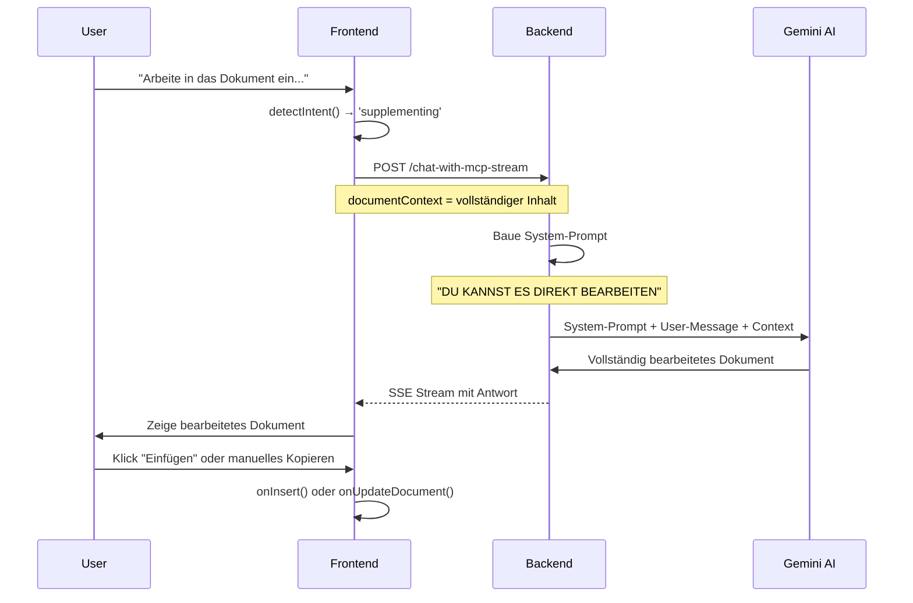

# Dokumentbearbeitungs-Fähigkeit für KI-Assistent

## Problem

Der KI-Assistent konnte zwar den Dokumentinhalt lesen, wusste aber nicht, dass er das Dokument **direkt bearbeiten** kann. 

Beispiel-Anfrage des Users:
```
"Arbeite in das Dokument ein, dass es sich um ein Living-Document handelt, 
und von mir (Thorsten Zörner) bearbeitet wird."
```

Ursprüngliche Antwort:
```
"Sie müssten das Dokument außerhalb dieses Systems anpassen und das 
aktualisierte Dokument gegebenenfalls erneut hochladen..."
```

## Lösung

### Backend-Änderungen (`backend/src/routes/ai-enhanced.ts`)

Erweitert System-Prompt um **explizite Dokumentbearbeitungs-Instruktionen**:

```typescript
📝 DOKUMENTEN-BEARBEITUNG:
Wenn der User Änderungen am aktuellen Dokument möchte 
(z.B. "Arbeite ein...", "Füge hinzu...", "Ergänze...", "Ändere..."):

1. Du kannst das Dokument DIREKT bearbeiten - der vollständige Inhalt ist verfügbar!
2. Gib den VOLLSTÄNDIG AKTUALISIERTEN Dokumentinhalt in deiner Antwort zurück
3. Nutze YAML-Frontmatter für Metadaten (author, type, last_updated, etc.)
4. Beispiel-Struktur:
   ```markdown
   ---
   author: [Name]
   type: Living Document
   last_updated: 2025-11-13
   ---
   
   # Dokumenttitel
   
   [Dokumentinhalt...]
   ```
5. Erkläre kurz WELCHE Änderungen du vorgenommen hast
6. Der User kann deine Änderungen dann direkt ins Dokument übernehmen
```

**Wichtig:** Kontext-Hinweis wurde ebenfalls verstärkt:
```typescript
contextHints.push(
  `📄 Vollständiges Dokument (${docLength} Zeichen) verfügbar - 
   DU KANNST ES DIREKT BEARBEITEN!`
);
```

### Frontend-Änderungen (`frontend/src/components/AIAssistant.tsx`)

Erweitert Intent-Erkennung um **"arbeite.*ein"** Pattern:

```typescript
if (/(ergänz|erweitere|füge.*hinzu|mehr|ausführlich|arbeite.*ein)/i.test(lowerMsg)) {
  return 'supplementing';
}
```

Dies kategorisiert Anfragen wie "Arbeite in das Dokument ein..." als `supplementing`-Intent.

## Anwendungsbeispiele

### 1. Autorenschaft hinzufügen

**User-Anfrage:**
```
Arbeite in das Dokument ein, dass es sich um ein Living-Document handelt, 
und von mir (Thorsten Zörner) bearbeitet wird.
```

**Erwartete KI-Antwort:**
```markdown
Ich habe die Metadaten am Dokumentanfang ergänzt:

---
author: Thorsten Zörner
type: Living Document
last_updated: 2025-11-13
---

# [Ursprünglicher Titel]

[Rest des Dokuments unverändert...]
```

### 2. Disclaimer hinzufügen

**User-Anfrage:**
```
Füge am Anfang einen Disclaimer ein, dass dies ein Entwurf ist.
```

**Erwartete KI-Antwort:**
```markdown
Ich habe einen Disclaimer am Dokumentanfang eingefügt:

> ⚠️ **ENTWURF** - Dieses Dokument befindet sich noch in Bearbeitung.

# [Dokumenttitel]

[Rest des Dokuments...]
```

### 3. Zusammenfassung ergänzen

**User-Anfrage:**
```
Ergänze eine Executive Summary am Anfang.
```

**Erwartete KI-Antwort:**
```markdown
Ich habe eine Executive Summary nach dem Titel eingefügt:

# [Dokumenttitel]

## Executive Summary

[KI generierte Zusammenfassung basierend auf Dokumentinhalt]

[Rest des Dokuments...]
```

## Workflow

1. **User stellt Bearbeitungsanfrage** im KI-Assistent-Chat
2. **Frontend** erkennt Intent (`supplementing`/`editing`)
3. **Backend** erhält vollständigen Dokumentinhalt via `documentContext`
4. **System-Prompt** instruiert KI: "Du kannst das Dokument direkt bearbeiten"
5. **KI generiert** vollständig aktualisierte Markdown-Version
6. **User erhält** neuen Inhalt im Chat
7. **User kopiert** den Inhalt (manuell oder via "Einfügen"-Button)
8. **Editor** wird mit neuer Version aktualisiert

## Frontmatter-Format

Die KI wurde instruiert, **YAML-Frontmatter** für Metadaten zu nutzen:

```yaml
---
author: Thorsten Zörner
type: Living Document
last_updated: 2025-11-13
version: 1.0
status: Draft
tags: [energiewirtschaft, netzentgelte]
---
```

Dieses Format ist kompatibel mit:
- GitHub Pages
- Jekyll
- Hugo
- Obsidian
- VS Code Markdown Preview
- Pandoc

## Technische Details

### Datenfluss



### Geänderte Dateien

1. **`backend/src/routes/ai-enhanced.ts`** (2 Änderungen):
   - Zeile ~265: System-Prompt erweitert (streaming version)
   - Zeile ~600: System-Prompt erweitert (non-streaming version)

2. **`frontend/src/components/AIAssistant.tsx`** (1 Änderung):
   - Zeile ~67: Intent-Detection erweitert um `arbeite.*ein`

## Deployment

```bash
# Backend
rsync -av backend/src/routes/ai-enhanced.ts root@10.0.0.14:/root/markmedit/backend/src/routes/

# Frontend
rsync -av frontend/src/components/AIAssistant.tsx root@10.0.0.14:/root/markmedit/frontend/src/components/

# Rebuild & Deploy
ssh root@10.0.0.14 "cd /root/markmedit && docker-compose build && docker-compose up -d"
```

**Deployment-Datum:** 2025-11-13

## Nächste Schritte

**Optionale Verbesserungen:**

1. **Auto-Insert-Button**: Direkter "Ins Dokument übernehmen" Button im Chat
2. **Diff-Ansicht**: Vorher/Nachher-Vergleich der Änderungen
3. **Undo-Funktion**: Rückgängig-Machen von übernommenen KI-Änderungen
4. **Template-Vorlagen**: Vordefinierte Frontmatter-Templates
5. **Metadaten-Editor**: UI-basierte Metadaten-Verwaltung

## Testing

**Manuelle Tests durchführen:**

```bash
# 1. Öffne ein Dokument im Editor
# 2. KI-Assistent Tab
# 3. Teste diese Anfragen:

"Arbeite in das Dokument ein, dass es von [Name] bearbeitet wird"
"Füge am Anfang ein Frontmatter mit Autor und Datum hinzu"
"Ergänze eine Zusammenfassung am Dokumentanfang"
"Ändere die Überschrift auf [Neuer Titel]"
```

**Erwartetes Verhalten:**
- ✅ KI gibt vollständiges, bearbeitetes Dokument zurück
- ✅ Frontmatter wird korrekt formatiert
- ✅ KI erklärt, welche Änderungen vorgenommen wurden
- ✅ User kann Inhalt kopieren und einfügen
- ✅ Originaldokument bleibt unverändert (bis User übernimmt)

## Referenzen

- [YAML Frontmatter Spec](https://jekyllrb.com/docs/front-matter/)
- [Markdown Best Practices](https://www.markdownguide.org/basic-syntax/)
- [Gemini Function Calling](https://ai.google.dev/docs/function_calling)
