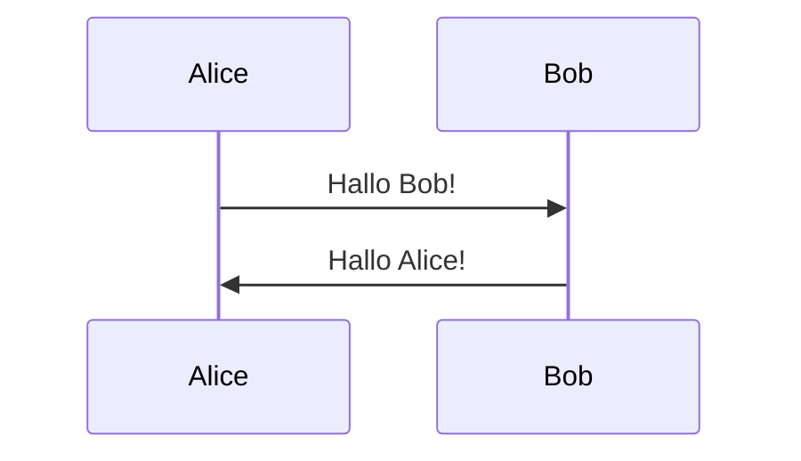
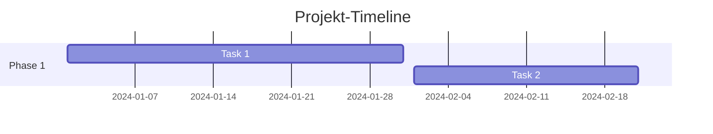

# Enhanced Editor Features

Dieses Dokument beschreibt die erweiterten Editor-Funktionen in MarkMEdit.

## ✨ Neue Features

### 1. 🖼️ Bild-Upload

**Funktion:** Hochladen und Verwalten von Bildern in Dokumenten

**Features:**
- Drag & Drop Upload
- Paste von Clipboard
- Automatische Bildoptimierung (max 2000x2000px)
- Thumbnail-Generierung (300px)
- Unterstützte Formate: JPEG, PNG, GIF, WebP
- Max. Dateigröße: 10 MB

**Verwendung:**
1. Klicke auf den Button "🖼️ Bild" in der Toolbar
2. Wähle ein Bild oder ziehe es in den Upload-Bereich
3. Das Bild wird hochgeladen und optimiert
4. Ein Markdown-Link wird automatisch eingefügt: ``

**Backend-Endpunkte:**
- `POST /api/images/upload` - Bild hochladen
- `GET /api/images/:filename` - Bild abrufen
- `GET /api/images/thumbnails/:filename` - Thumbnail abrufen
- `DELETE /api/images/:imageId` - Bild löschen
- `GET /api/images/document/:documentId` - Alle Bilder eines Dokuments

**Technologie:**
- `multer` - File Upload Middleware
- `sharp` - Bildverarbeitung und Optimierung
- Speicherort: `/data/uploads/` und `/data/uploads/thumbnails/`

---

### 2. 📊 Mermaid-Diagramme

**Funktion:** Erstellen und Anzeigen von Diagrammen direkt im Markdown

**Features:**
- Live-Rendering von Mermaid-Diagrammen
- Unterstützt alle Mermaid-Diagrammtypen:
  - Flowcharts (Flussdiagramme)
  - Sequence Diagrams (Sequenzdiagramme)
  - Gantt Charts
  - Class Diagrams
  - State Diagrams
  - Entity Relationship Diagrams
  - User Journey
  - Pie Charts
  - u.v.m.
- Fehleranzeige bei ungültiger Syntax

**Verwendung:**
1. Klicke auf den Button "📊 Diagramm" in der Toolbar
2. Ein Mermaid-Template wird eingefügt
3. Passe den Code an deine Bedürfnisse an
4. Wechsle in den Preview-Modus, um das Diagramm zu sehen

**Beispiel:**
```markdown
\`\`\`mermaid
graph TD
    A[Start] --> B{Entscheidung}
    B -->|Ja| C[Aktion 1]
    B -->|Nein| D[Aktion 2]
    C --> E[Ende]
    D --> E
\`\`\`
```

**Weitere Diagramm-Typen:**

**Sequenzdiagramm:**


**Gantt-Chart:**


**Technologie:**
- `mermaid` - Diagramm-Rendering Library
- Custom React-Komponenten für Integration
- Automatische Fehlerbehandlung

---

### 3. 📋 Tabellen-Editor

**Funktion:** Visuelles Erstellen und Bearbeiten von Markdown-Tabellen

**Features:**
- WYSIWYG-Editor für Tabellen
- Zeilen/Spalten hinzufügen und entfernen
- Header-Zeile aktivieren/deaktivieren
- Live Markdown-Vorschau
- Beliebig große Tabellen

**Verwendung:**
1. Klicke auf den Button "📋 Tabelle" in der Toolbar
2. Der Tabellen-Editor öffnet sich (Standard: 3x3 Tabelle)
3. Füge Zeilen/Spalten hinzu mit den "+" Buttons
4. Entferne Zeilen/Spalten mit den "✕" Buttons
5. Bearbeite Zell-Inhalte direkt im Editor
6. Klicke "Einfügen" um die Markdown-Tabelle einzufügen

**Features des Editors:**
- **Header-Zeile:** Checkbox aktiviert/deaktiviert die erste Zeile als Header
- **Dynamisch:** Beliebig viele Zeilen und Spalten
- **Vorschau:** Echtzeit-Markdown-Vorschau
- **Validation:** Mindestens 1 Zeile und 1 Spalte erforderlich

**Beispiel-Output:**
```markdown
| Spalte 1 | Spalte 2 | Spalte 3 |
| --- | --- | --- |
| Zelle 1 | Zelle 2 | Zelle 3 |
| Zelle 4 | Zelle 5 | Zelle 6 |
```

**Technologie:**
- Custom React-Komponente
- State-Management für Tabellen-Daten
- Markdown-Parser und Generator

---

## 🚀 Deployment

Alle Features sind bereits deployed auf:
- **Frontend:** http://10.0.0.14:3000
- **Backend:** http://10.0.0.14:3001

## 📦 Dependencies

**Backend:**
- `multer` ^1.4.5-lts.1 - File Upload
- `@types/multer` ^1.4.12
- `sharp` ^0.33.5 - Bildverarbeitung
- `@types/sharp` ^0.32.0

**Frontend:**
- `mermaid` ^11.4.1 - Diagramm-Rendering
- `react-markdown` (bereits vorhanden)
- `remark-gfm` (bereits vorhanden)

## 🔧 Technische Details

### Architektur

**Image Upload:**
```
Client → multer → ImageUploadService → sharp → File System
                                      ↓
                                   Thumbnail
```

**Mermaid Rendering:**
```
Markdown → ReactMarkdown → MermaidDiagram → mermaid.render() → SVG
```

**Table Editor:**
```
User Input → State → Markdown Generator → Monaco Editor
```

### Dateistruktur

**Backend:**
```
backend/src/
├── services/
│   └── image-upload.ts          # Image processing service
└── routes/
    └── images.ts                # Image API routes
```

**Frontend:**
```
frontend/src/components/
├── ImageUpload.tsx              # Upload component
├── ImageUploadModal.tsx         # Upload modal wrapper
├── MermaidDiagram.tsx           # Mermaid renderer
├── MermaidPreview.tsx           # Preview with code toggle
├── MarkdownWithMermaid.tsx      # Markdown + Mermaid renderer
└── TableEditor.tsx              # Table editor modal
```

## 🐛 Bekannte Limitierungen

1. **Bilder:**
   - Max. 10 MB pro Bild
   - Automatische Größenanpassung auf 2000x2000px
   - Keine Bildbearbeitung im Editor

2. **Mermaid:**
   - Komplexe Diagramme können Performance-Probleme verursachen
   - Syntax-Fehler werden angezeigt, aber nicht auto-korrigiert

3. **Tabellen:**
   - Keine Zell-Formatierung (fett, kursiv, etc.)
   - Keine Zell-Zusammenführung (colspan/rowspan)
   - Nur einfache Markdown-Tabellen

## 🎯 Zukünftige Erweiterungen

- [ ] Bildbearbeitung (Crop, Rotate, Filter)
- [ ] Mermaid-Syntax-Highlighting im Monaco Editor
- [ ] Erweiterte Tabellen-Formatierung
- [ ] Excel-Import für Tabellen
- [ ] Diagram Export (PNG, SVG)
- [ ] Tabellen-Sortierung und Filterung

## 📚 Weitere Dokumentation

- [Mermaid Dokumentation](https://mermaid.js.org/)
- [Multer Dokumentation](https://github.com/expressjs/multer)
- [Sharp Dokumentation](https://sharp.pixelplumbing.com/)
